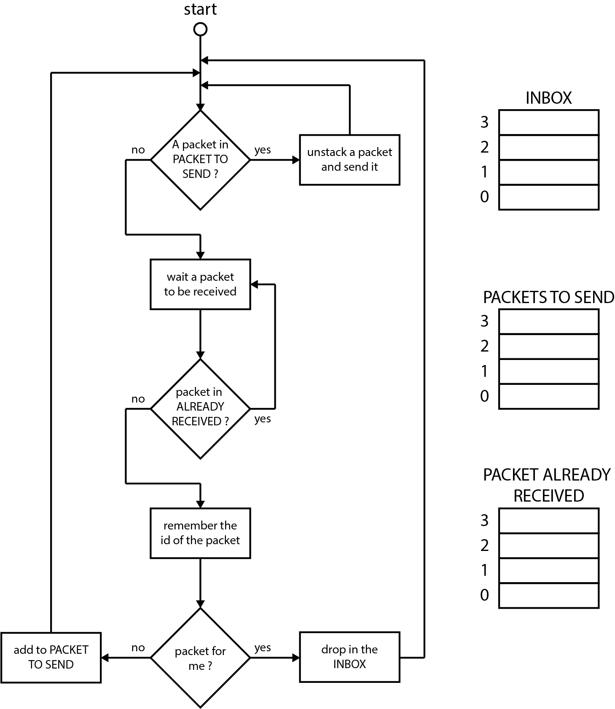
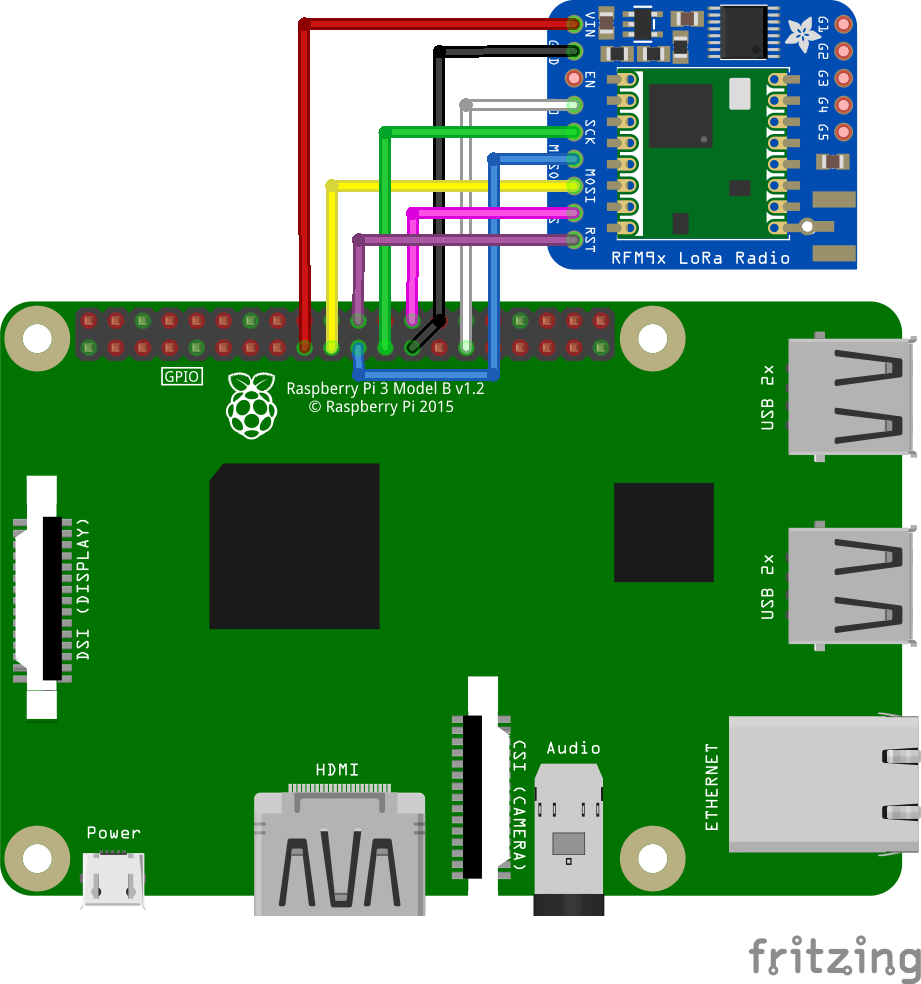

# Mesh LoRa

## Introduction

This project was initiated by the Bureau Études et Prospective of the Paris Fire Brigade. Its aim is to provide a resilient communication channel for the transmission of light data, such as the physiological state of the firefighters involved.

This repository presents a simple proof of concept for the mesh LoRa. To strictly reproduce this work, you must have :
- a [Raspberry Pi nano](https://www.raspberrypi.org/products/raspberry-pi-zero-w/)
-  an [adafruit](https://www.adafruit.com) RFM95 module (no longer sold)

If you do not have this hardware, you can also use this repository in simulation mode (see the usage section).

_Nota_ : This work has not been tested with the [newer versions of LoRa transmitters](https://www.adafruit.com/product/3073), but I'm very confident that it would work very well too. If you do, please let me know.

## Operating principle

Here is a simplistic animation of the transmission of a packet, from the sender to the recipient.


Here is the flow chart of the thread that manages the reception and retransmission of packets. From the point of view of the tag, the idea is simple: if a packet is not for me, and I never received it, I retransmit it.



## Installation (skip this section if you just want to use simulation)

If you read this section, I assume you have the proper hardware (Raspberry Pi + RFM95).

Connect the RFM95 module like this: 


| Raspberry Pi                | Adafruit GPS |
|-----------------------------|--------------|
| Pin n°2 (```5V```)          | ```Vin```    |
| Pin n°6 (```GND```)         | ```GND```    |
| (nothing)                   | ```EN```     |
| Pin n°29 (```GPIO5```)      | ```G0```     |
| Pin n°23 (```SPI0_SCLK```)  | ```SCK```    |
| Pin n°21 (```SPI0_MISO```)  | ```MISO```   |
| Pin n°19 (```SPI0_MOSI```)  | ```MOSI```   |
| Pin n°26 (```SPI0_CE1_N```) | ```CS```     |
| Pin n°22 (```GPIO25```)     | ```RST```    |

Clone the repo and run:
```
pip3 install -r requirement.txt
```


## Usage

First, in ```main.py```, make sure you're in the mode you want: 
- Choose whether you want to use the simulation or not.
```python
simulation = True
```

- Choose the id of you beacon:
```python
my_messenger = Messenger(rfm95, id_in_network=255)
```

Then, run

```
python3 main.py
```

All new messages sent to you end up in ```inbox.json```. They match the following pattern:
```json
[
    ...,
    {
        "id_from": 5,
        "id_to": 1,
        "id_packet": 189,
        "flags": 0,
        "message": "message content"
    },
    ...
]
```


## Planned improvement
 - Time to Live


## License

MIT License

## Contributor

- SLT Quentin GALLOUÉDEC