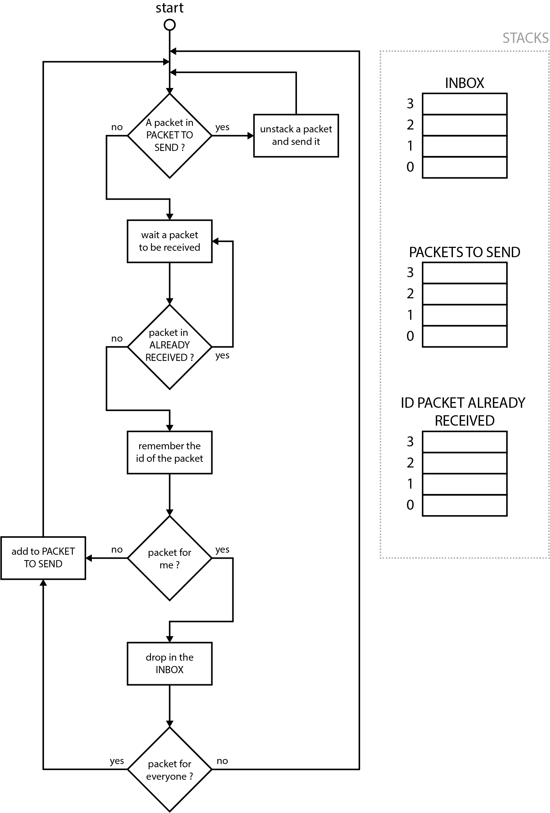

# Mesh LoRa

## Introduction

This project was initiated by the Bureau Études et Prospective of the Paris Fire Brigade. Its aim is to provide a resilient communication channel for the transmission of light data, such as the physiological state of the firefighters involved.

## Installation

## Usage

## Operating principle

Here is a simplistic animation of the transmission of a packet, from the sender to the recipient.

Here is the flow chart of the thread that manages the reception and retransmission of packets. From the point of view of the tag, the idea is simple: if a packet is not for me, and I never received it, I retransmit it.

## Planned improvement
 - Time to Live

## License

MIT License

## Contributor

- SLT Quentin GALLOUÉDEC